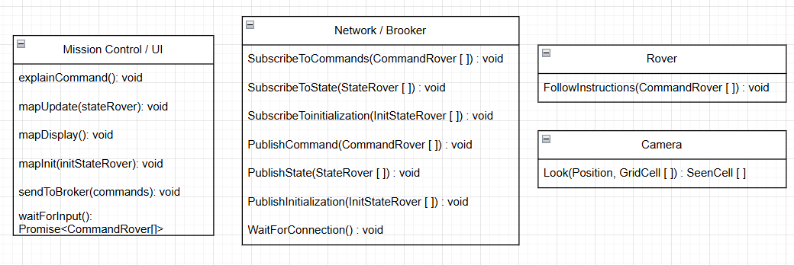
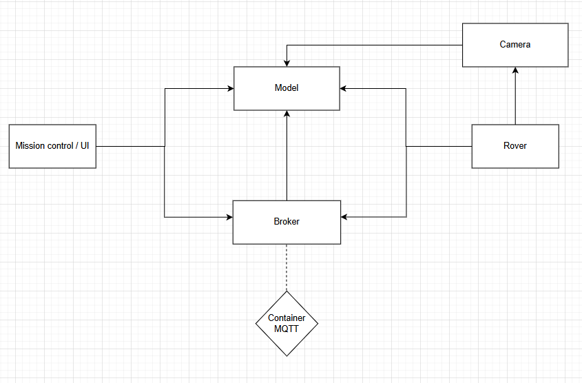

# Projet Rover sur Mars | Cours Architecture Logiciel

## Lancer le projet

### Pré-requis

- Docker
- Node.js

#### Installer les librairies

```bash
npm install
```

### Lancer l'infrastructure

```bash
docker compose up -d --wait
```

### Lancer le rover

```bash
npm run start-rover
```

### Lancer l'interface de contrôle (Mission Control)

```bash
npm run start-mission-control
```

### Lancer l'interface Web (BONUS)

```bash
npm run build:ui
serve -s dist/ui
```

## Cahier des charges du projet Rover sur Mars

### Objectif général

Mettre en oeuvre une simulation réseau d’un Rover autonome capable de recevoir et exécuter des commandes à distance via une console de pilotage, en respectant une logique de mouvement sur une planète toroïdale, avec obstacles inconnus et possibilité de répéteurs réseau.

### Fonctionnalités du Rover

- Déplacements (Avancer, Reculer, Tourner à gauche 90°, Tourner à droite 90°)
- Envoie de position
- Signalement d'obstacle
- Execution d'une séquence de commandes (mouvements)

### Communication

Les échanges entre le rover et mission-control se font indirectement via une architecture pub/sub et donc un broker. Par exemple, lorsque rover est démarré, il s'abonne ("sub") à un topic recevant des commandes publiées ("pub") par mission-control. Dès qu'un message est publié, ce dernier est récupéré et lu par rover. Dans l'autre sens et de manière similaire, mission-control s'abonne à un topic où rover publie ses changements d'états après chaque commande.

### Interface : Mission Control

La console de pilotage, permet d'envoyer les commandes individuelles, ou les séquences de commandes.
L'affichage est une grille mis à jour après chaque mouvement avec la position actuelle du Rover, ainsi que les obstacles découverts.




### Bonus

#### Caméra

Ajout d'un module caméra, que le rover utilise pour voir autour de lui à chaque déplacement, celle-ci renvoie le type de chaque cellule à côté du rover.

#### Front Web

Un front-end web interactif a été développé afin de visualiser la carte en temps réel et piloter le rover depuis une interface utilisateur graphique.
